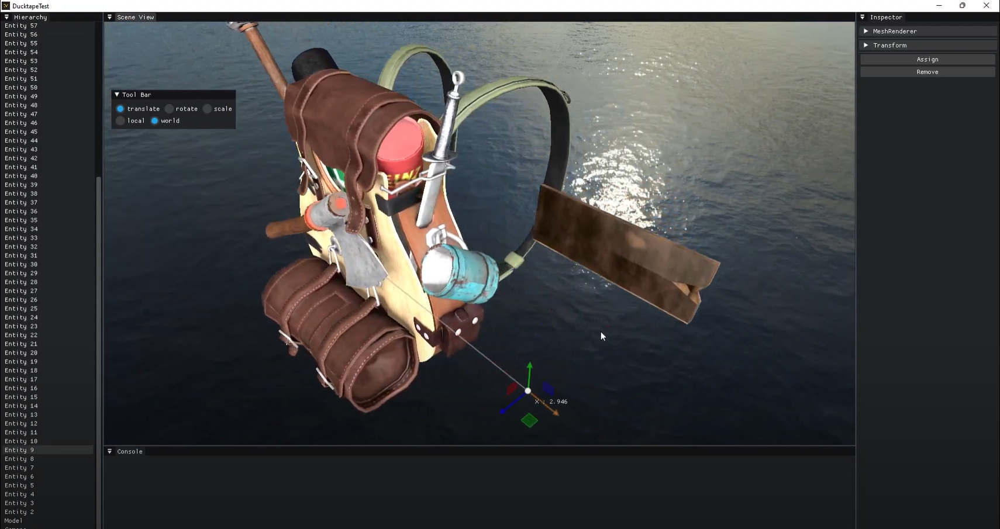

   

    

<h1 align="center">Convenience, that's Ducktape.</h1>

    
    
    
    
    
    

    <a href="https://dsc.gg/Ducktape" target="blank">Discord</a>
    ·
    <a href="https://github.com/DucktapeEngine/Ducktape/issues/new?assignees=&labels=&template=bug_report.md&title=">Report Bug</a>
    ·
    <a href="https://github.com/DucktapeEngine/Ducktape/issues/new?assignees=&labels=&template=feature_request.md&title=">Request Feature</a>

    

# Ducktape
An open source 3d C++ game engine.

*If you like what you see, consider starring the repo! It helps.*

## Get Started
The Engine is not ready for usage as of now.

## Documentation
Documentation is still in the works.
    
## Contributing
Refer to [CONTRIBUTING.md](CONTRIBUTING.md)
    
## License
This project is licensed under the MIT License - see the [`LICENSE`](LICENSE) file for details.